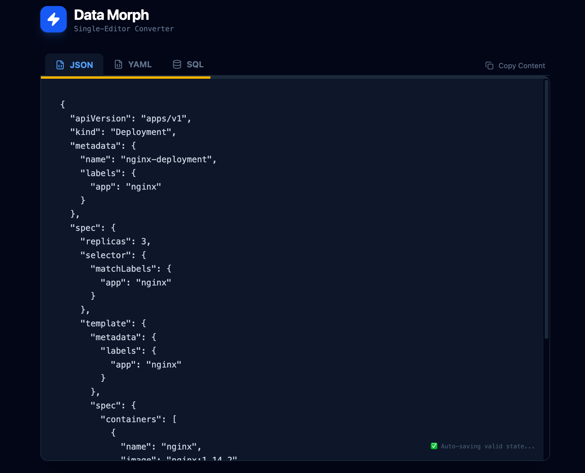
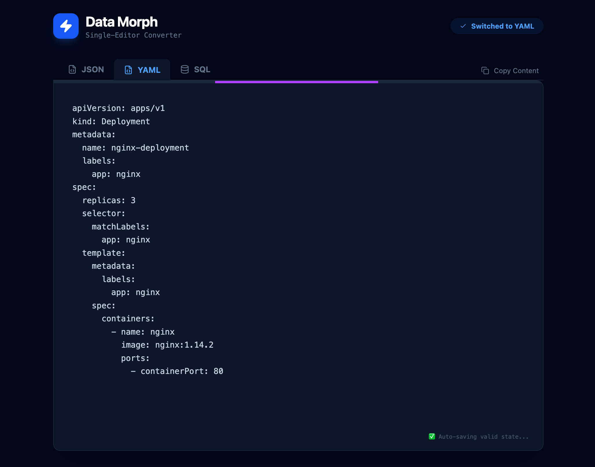
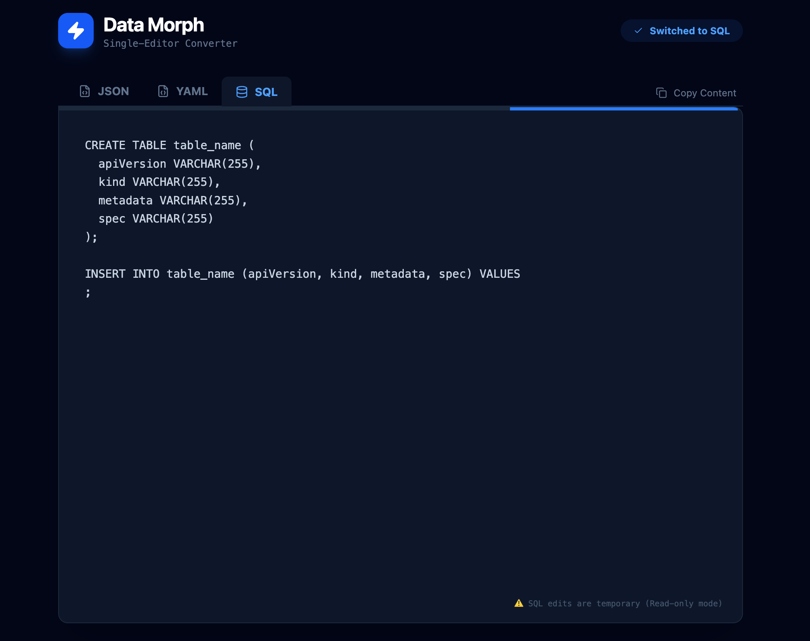

<div align="center">

  # ⚡ Data Morph
  
  **The smart, single-editor data converter. Switch tabs, convert instantly.**
  <br>
  **极简的智能数据转换器。一个编辑器，三种格式，切换即转换。**

  [](https://react.dev)
  [](https://tailwindcss.com)
  
  [**🚀 Live Demo / 在线使用**](https://data-morph-omega.vercel.app)
  
</div>

---





## 📖 Introduction

**Data Morph** is a minimalist tool designed for developers who need to switch between data formats fast. 

Unlike traditional "Split View" converters, Data Morph uses a **"Single Source of Truth"** architecture. It intelligently caches your last valid data object. This means you can switch from JSON to YAML, mess up the YAML, and switch back to JSON—it will automatically fix itself using the cached data.

**Data Morph** 摒弃了传统的“左右对照”模式，采用“单一编辑器”设计。它在后台智能缓存最后一次有效的数据结构，支持在 JSON、YAML 和 SQL 之间无缝切换。即使你在某种格式下输入了错误代码，切回其他格式时也能自动恢复，实现“自动纠错”。

## ⚡ Features

* **🧠 Smart Context Switching:** Just click a tab (JSON/YAML/SQL) to convert the current content instantly.
* **🛡️ Auto-Correction:** Messed up your YAML? Switching tabs automatically regenerates code from the last valid state.
* **🔒 Read-Only SQL:** Generates `CREATE TABLE` and `INSERT` statements automatically from your data.
* **🌑 Zen Mode:** A distraction-free, dark-themed interface focused on your code.
* **⚡ Local Processing:** Zero latency, 100% privacy. All conversions happen in your browser.

## 📦 Getting Started

1.  **Clone the repository**
    ```bash
    git clone [https://github.com/xingchengzhu/data-morph.git](https://github.com/xingchengzhu/data-morph.git)
    cd data-morph
    ```

2.  **Install dependencies**
    ```bash
    npm install
    ```

3.  **Run development server**
    ```bash
    npm run dev
    ```

## 🛠️ Tech Stack

* **Framework:** React 19 + Vite
* **Styling:** Tailwind CSS v4
* **Core Logic:** `js-yaml` for parsing and dumping
* **Icons:** Lucide React

## 📄 License

MIT License.

---
<div align="center">
  <sub>Built with ❤️ by <a href="https://github.com/xingchengzhu">Xingcheng Zhu</a></sub>
</div>